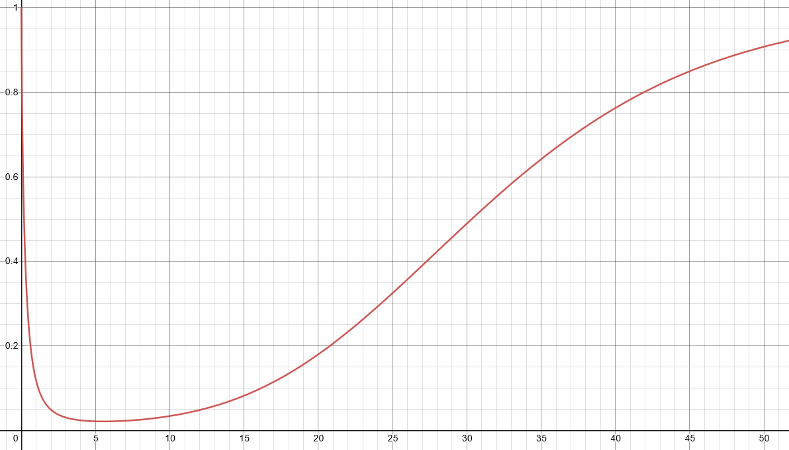

# Graph Search, Shortest Paths, and Data Structures

by Stanford University

## About this Course

The primary topics in this part of the specialization are: data structures (heaps, balanced search trees, hash tables, bloom filters), graph primitives (applications of breadth-first and depth-first search, connectivity, shortest paths), and their applications (ranging from deduplication to social network analysis).

### Week 1

Breadth-first and depth-first search; computing strong components; applications.

Graph analysed for Strongly connected component lengths. (875715 Nodes)

### Week 2

Dijkstra's shortest-path algorithm on weighted Graphs.

Graph analysed for shorted paths. (200 Nodes)

### Week 3

Heaps; balanced binary search trees.

### Week 4

Hashing; bloom filters.

The probability of an insertion error in an 8-bit bloom filter. The X axis represents the number of hashing functions.

Following the online course:
<https://www.coursera.org/learn/algorithms-graphs-data-structures>
