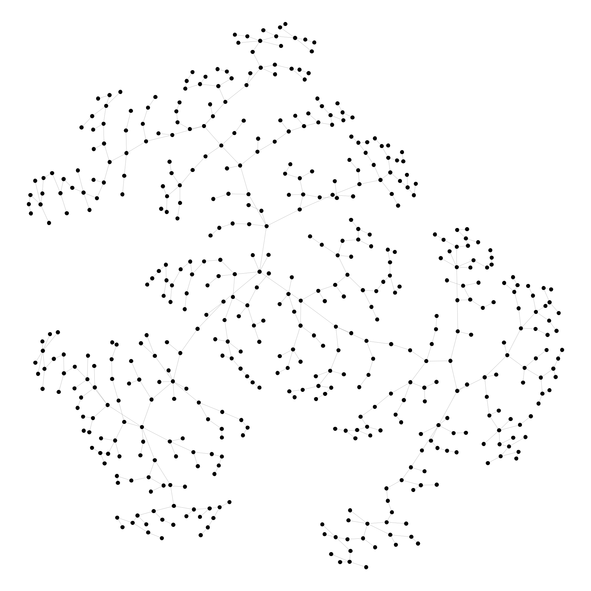
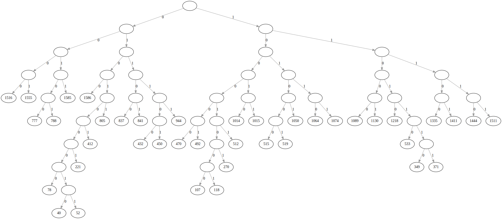

# Greedy Algorithms, Minimum Spanning Trees, and Dynamic Programming

by Stanford University

## About this Course

The primary topics in this part of the specialization are: greedy algorithms (scheduling, minimum spanning trees, clustering, Huffman codes) and dynamic programming (knapsack, sequence alignment, optimal search trees).

### Extra

I analysed the runtime of different minimum spanning tree algorithms and compared the running time. Although the asymtotic analysis predicts the opposite, Prim's MST algorithm is faster than Pettie's and Ramachandran's optimal MST algorithm.

### Week 1

Two motivating applications; selected review; introduction to greedy algorithms; a scheduling application; Prim's MST algorithm.

Prim's MST algorithm was used to convert a 500 Node 2500 Edge Graph into a minimum spanning tree.

| Relaxed graph               |  Minimum spanning tree      |
| :-------------------------: | :-------------------------: |
|   |     |

### Week 2

Kruskal's MST algorithm and applications to clustering; advanced union-find.

|  Graph clustert by edge weight into 4 Sub-Graphs         |
| :------------------------------------------------------: |
|                 |

### Week 3

Huffman codes; introduction to dynamic programming.

| Huffman code for symbol frequencies from a list ([full version](huffmann/huffman.dot.svg?raw=1)) |
| :----------------------------------------------------------------------------: |
|                                    |

### Week 4

Advanced dynamic programming: the knapsack problem, sequence alignment, and optimal binary search trees.

Following the online course:
<https://www.coursera.org/learn/algorithms-greedy>
