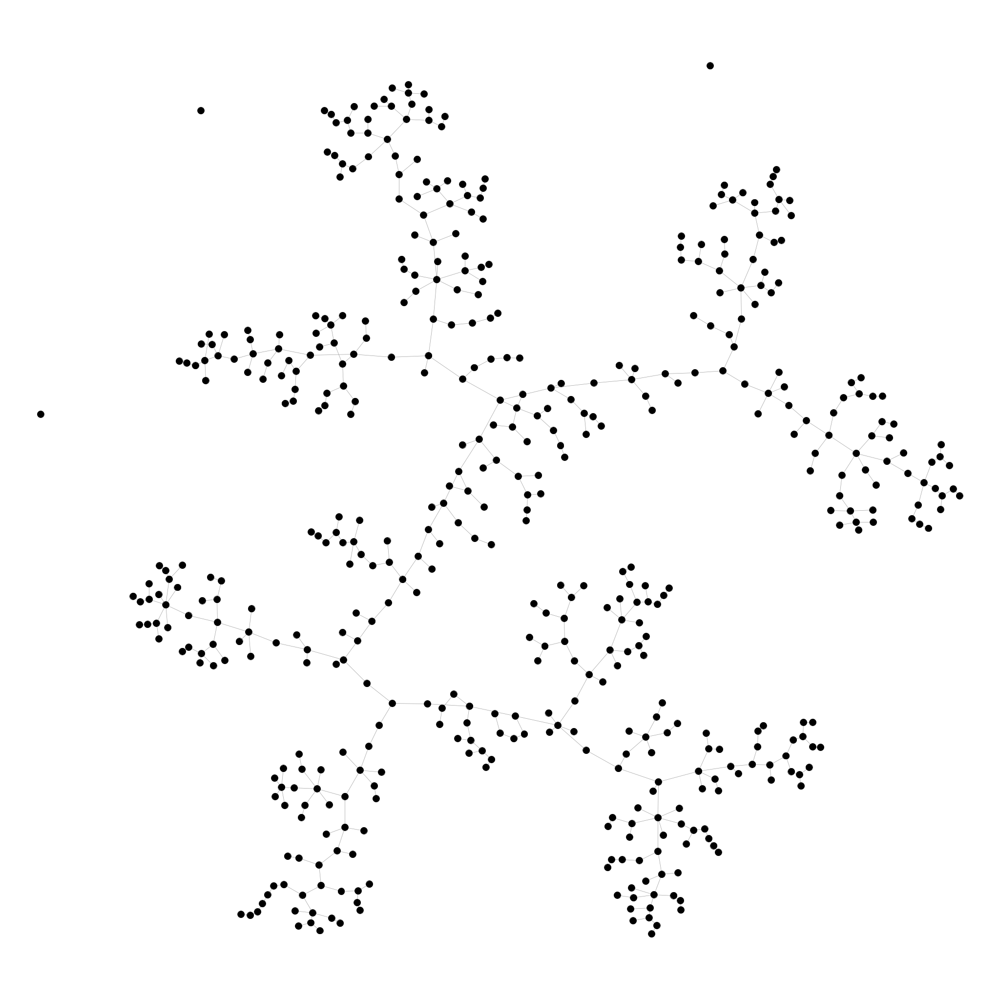

# Greedy Algorithms, Minimum Spanning Trees, and Dynamic Programming

by Stanford University

## About this Course

The primary topics in this part of the specialization are: greedy algorithms (scheduling, minimum spanning trees, clustering, Huffman codes) and dynamic programming (knapsack, sequence alignment, optimal search trees).

### Week 1

Two motivating applications; selected review; introduction to greedy algorithms; a scheduling application; Prim's MST algorithm.

Prim's MST algorithm was used to convert a 500 Node 2500 Edge Graph into a minimum spanning tree.

| Relaxed graph               |  Minimum spanning tree      |
| :-------------------------: | :-------------------------: |
|   |     |

### Week 2

Kruskal's MST algorithm and applications to clustering; advanced union-find.

|  Graph clustert by edge weight into 4 Sub-Graphs         |
| :------------------------------------------------------: |
|                 |

### Week 3

Huffman codes; introduction to dynamic programming.

### Week 4

Advanced dynamic programming: the knapsack problem, sequence alignment, and optimal binary search trees.

Following the online course:
<https://www.coursera.org/learn/algorithms-greedy>
